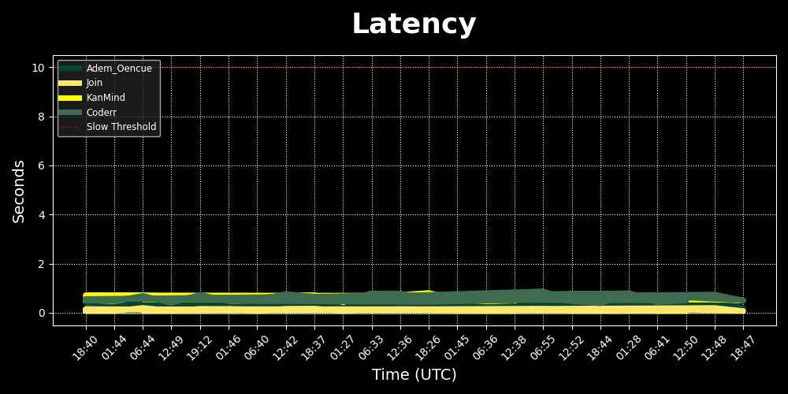

This repository automatically checks the status of my websites at regular intervals.

## Live Status
<!-- START_STATUS -->

| Website | Status | Latency | Info | Uptime |
| :--- | :---: | :---: | :--- | :---: |
| **Adem_Oencue** |  | `0.24s` | 200 (0.24s) |  |
| **Join** |  | `0.07s` | 200 (0.07s) |  |
| **KanMind** |  | `0.51s` | 200 (0.51s) |  |
| **Coderr** |  | `0.50s` | 200 (0.50s) |  |

_Last updated: 13.02.2026 01:51 UTC_
<!-- END_STATUS -->