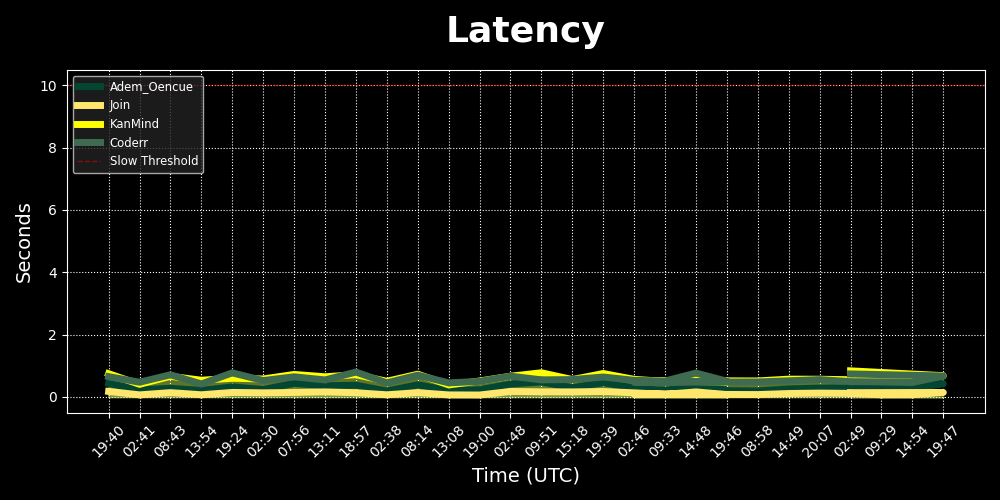

This repository automatically checks the status of my websites at regular intervals.

## Live Status
<!-- START_STATUS -->

| Website | Status | Latency | Info | Uptime |
| :--- | :---: | :---: | :--- | :---: |
| **Adem_Oencue** |  | `0.25s` | 200 (0.25s) |  |
| **Join** |  | `0.12s` | 200 (0.12s) |  |
| **KanMind** |  | `0.55s` | 200 (0.55s) |  |
| **Coderr** |  | `0.58s` | 200 (0.58s) |  |

_Last updated: 31.03.2026 13:06 UTC_
<!-- END_STATUS -->