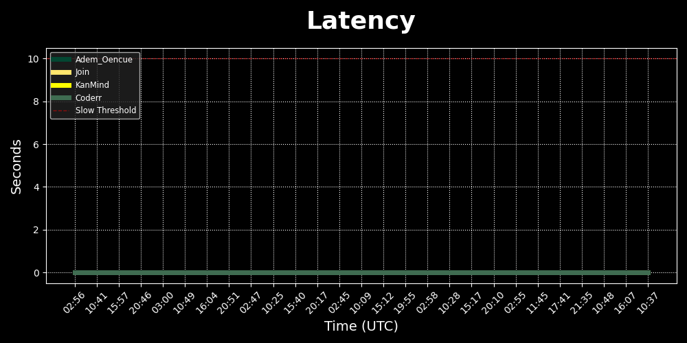

This repository automatically checks the status of my websites at regular intervals.

## Live Status
<!-- START_STATUS -->

| Website | Status | Latency | Info | Uptime |
| :--- | :---: | :---: | :--- | :---: |
| **Adem_Oencue** |  | `0.00s` | Status: 404 |  |
| **Join** |  | `0.00s` | Status: 404 |  |
| **KanMind** |  | `0.00s` | Timeout |  |
| **Coderr** |  | `0.00s` | Timeout |  |

_Last updated: 03.09.2026 02:35 UTC_
<!-- END_STATUS -->